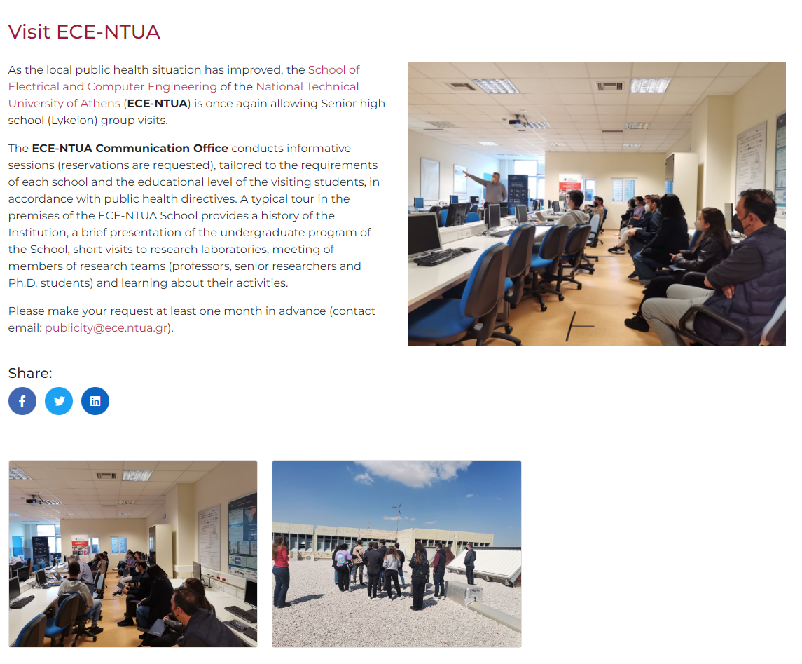
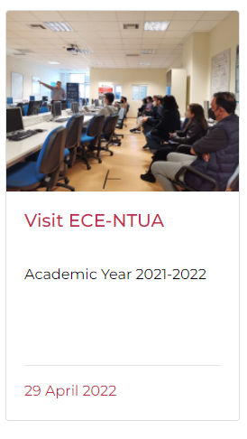

# Website for TEAM Master NTUA.

This website was created by [Spyros Bekiaris](https://github.com/spyrosbek) and [Panagiotis Tzortzis](https://github.com/tzortzispanagiotis), researchers - software engineers @ AILS Lab, NTUA, with the guidance and coordination of [Nikolas Papadopoulos](https://github.com/nikolo555) of BioSim NTUA.

We leveraged the power of Jekyll static site generator to power the functionality of the site, which was built using sass and html.

Basic aspects of the website can be changed by non-technical people. Below there is detailed information on how to edit.

## Edit site

Generally, when someone does a commit and pushes on main branch, stuff is automatically deployed by github actions (built in CI). So the general pipeline for changing things is:
clone code - make changes - commit - push on master

## Edit faculty page

In order to add - remove - edit people from the faculty page, you just have to modify the _data/people.yml. This is a yaml list, whose each item need the following fields (with * we mark the required fields):

- *Image: absolute path of the image displayed for the person. All images of people exist under theme/img/team.
- *Name: full name to be displayed
- *Category: this field serves the purpose of dividing people in categories. Choose one of the following values: Professors, Staff, Collaborators, Researchers
- *Title1: Title of person (e.g. secretariat, researcher, professor, associate professor etc)
- *Title2: brief, 1-sentence description
- School: faculty of person
- Email: email of person
- Phone: phone of person
- Website: website of person
- Bio: bio of person
- Office: deprecated, no need to fill this
- *modalId: an id for the person, fill as you wish

When a field is null, it should be marked as null eg Phone: null, not to be left empty.

## Add a new post

TLDR;

- create a new md file on _posts directory with pattern YYYY-MM-DD-short-name-you-choose.md
- create a folder inside post_assets with any name you choose
- put images in new folder you created on post_assets
- create the post by supplying title, description, directory, thumb, images (optional) on header and then the post text on markdown

### Detailed guide

This is how a common post looks like:

</img>

And this is how the post grid-card looks like (when post is shown on lists like newsfeed on main page, or news page):

</img>

Every post lives inside _posts directory, and should have a naming of the following pattern: YYYY-MM-DD-short-name.md
where YYYY-MM-DD is the post creation date and then following with dashes you give a short name to the post.

For every post that contains images (which is, every post :p ) you should create a directory inside post_assets dir, where you can put all images to be included in the post.

Every post file has a "header" (frontmatter to be precise) with the following fields:

\--- 
**title**: the title of the post (on example: Visit ECE-NTUA)  
**description**: the short description appeared on post grid cards (on example: Academic Year 2021-2022) 
**directory**: the name of directory (NOT path) that contains assets (images) for the post. visit-ece-ntua 
**thumb**: the image (existing inside directory specified above) that would serve as a thumbnail for the post (main image) 
**images**: (optional) a list of image names (existing inside directory specified above) that would be included in post gallery 
  \- img-1.jpg 
  \- img-2.jpg   
\---

After the header, the post document (on markdown) follows.

To write a post, you can leverage many functions of markdown language (such as italics, bolds, links etc). Below we attach a markdown cheatsheet to make it easy for you.

## Useful stuff

Markdown documentation: https://www.markdownguide.org/cheat-sheet/

Maintainer's email: tzortzispanagiotis@gmail.com
